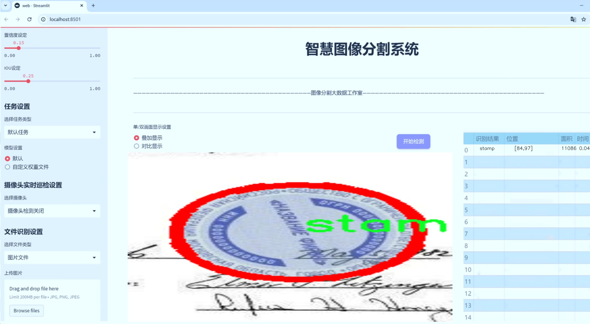
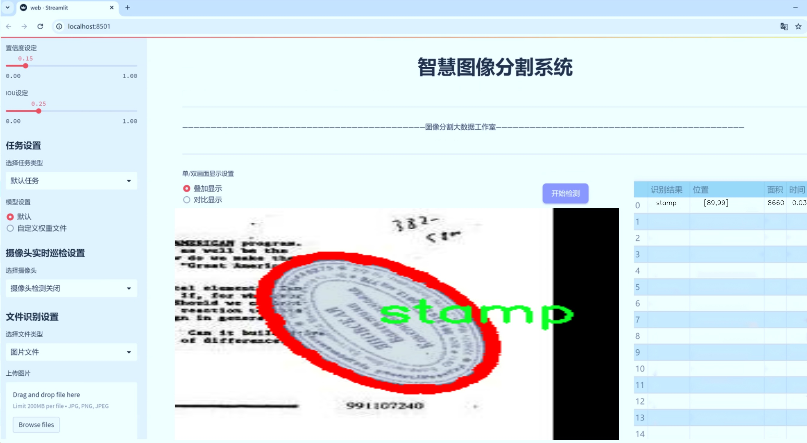
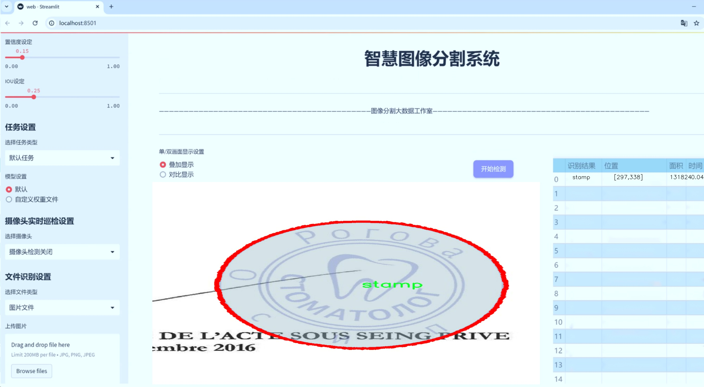
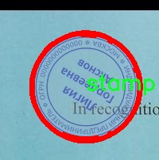

# 邮票图像分割系统源码＆数据集分享
 [yolov8-seg-C2f-RFCBAMConv＆yolov8-seg-C2f-DWR等50+全套改进创新点发刊_一键训练教程_Web前端展示]

### 1.研究背景与意义

项目参考[ILSVRC ImageNet Large Scale Visual Recognition Challenge](https://gitee.com/YOLOv8_YOLOv11_Segmentation_Studio/projects)

项目来源[AAAI Global Al lnnovation Contest](https://kdocs.cn/l/cszuIiCKVNis)

研究背景与意义

随着数字化时代的到来，图像处理技术在各个领域中得到了广泛应用，尤其是在文物保护、艺术品鉴定和邮票收藏等领域。邮票作为一种独特的文化载体，不仅承载着历史和艺术的价值，同时也是集邮爱好者和研究者的重要研究对象。然而，传统的邮票图像处理方法往往依赖于人工识别和分类，效率低下且容易受到人为因素的影响。因此，开发一种高效、准确的邮票图像分割系统显得尤为重要。

在这一背景下，YOLO（You Only Look Once）系列模型因其高效的实时目标检测能力而受到广泛关注。YOLOv8作为该系列的最新版本，结合了深度学习的先进技术，能够在复杂环境中实现快速而准确的目标检测。通过对YOLOv8模型的改进，特别是在邮票图像分割任务中的应用，能够显著提升邮票图像的处理效率和准确性。这不仅为邮票的自动识别和分类提供了技术支持，也为相关研究提供了新的思路和方法。

本研究将基于改进的YOLOv8模型，构建一个专门针对邮票图像的分割系统。该系统将利用一个包含7500张邮票图像的数据集，进行实例分割任务。数据集中仅包含一类目标——邮票，这为模型的训练和优化提供了良好的基础。通过对该数据集的深入分析与处理，研究将探讨如何在邮票图像中实现高精度的实例分割，进而提升邮票的识别率和分类效果。

邮票图像分割系统的研究不仅具有重要的学术价值，也具有广泛的应用前景。首先，该系统可以为邮票收藏者提供便捷的邮票管理工具，帮助他们快速识别和分类邮票，提高收藏的乐趣和效率。其次，在文物保护和数字化档案管理方面，该系统能够为邮票的数字化保存提供技术支持，确保珍贵邮票的历史信息得以保存和传承。此外，该研究还可以为计算机视觉领域的实例分割技术提供新的应用案例，推动相关技术的进一步发展。

综上所述，基于改进YOLOv8的邮票图像分割系统的研究，不仅能够提升邮票图像处理的效率和准确性，还有助于推动邮票文化的传播与保护。通过这一研究，我们希望能够为邮票的数字化管理和相关领域的研究提供新的技术手段和理论支持，进而促进邮票文化的传承与发展。

### 2.图片演示







##### 注意：由于此博客编辑较早，上面“2.图片演示”和“3.视频演示”展示的系统图片或者视频可能为老版本，新版本在老版本的基础上升级如下：（实际效果以升级的新版本为准）

  （1）适配了YOLOV8的“目标检测”模型和“实例分割”模型，通过加载相应的权重（.pt）文件即可自适应加载模型。

  （2）支持“图片识别”、“视频识别”、“摄像头实时识别”三种识别模式。

  （3）支持“图片识别”、“视频识别”、“摄像头实时识别”三种识别结果保存导出，解决手动导出（容易卡顿出现爆内存）存在的问题，识别完自动保存结果并导出到tempDir中。

  （4）支持Web前端系统中的标题、背景图等自定义修改，后面提供修改教程。

  另外本项目提供训练的数据集和训练教程,暂不提供权重文件（best.pt）,需要您按照教程进行训练后实现图片演示和Web前端界面演示的效果。

### 3.视频演示

[3.1 视频演示](https://www.bilibili.com/video/BV1qLyBYpEvL/)

### 4.数据集信息展示

##### 4.1 本项目数据集详细数据（类别数＆类别名）

train: ../train/images
val: ../valid/images
test: ../test/images

nc: 1
names: ['stamp']

roboflow:
  workspace: stampseg
  project: instance-rjrqr
  version: 9
  license: CC BY 4.0
  url: https://universe.roboflow.com/stampseg/instance-rjrqr/dataset/9

##### 4.2 本项目数据集信息介绍

数据集信息展示

在本研究中，我们使用了名为“instance”的数据集，以训练和改进YOLOv8-seg的邮票图像分割系统。该数据集专注于邮票图像的分割任务，旨在提高模型在识别和分割邮票方面的准确性和效率。数据集的构建经过精心设计，确保其在实际应用中的有效性和可靠性。

数据集包含三个主要部分：训练集、验证集和测试集。训练集位于“../train/images”目录下，包含了大量的邮票图像，这些图像经过标注，能够为模型提供丰富的学习样本。验证集则存放在“../valid/images”目录中，主要用于在训练过程中评估模型的性能，以便及时调整超参数和优化策略。测试集位于“../test/images”目录，专门用于最终的模型评估，确保模型在未见数据上的泛化能力。

该数据集的类别数量为1，类别名称为“stamp”。这一单一类别的设计使得模型可以专注于邮票的特征提取和分割任务，避免了多类别干扰的复杂性。邮票作为一个特定的对象，其形状、颜色和细节各异，构成了丰富的视觉信息，适合用于深度学习模型的训练。通过集中于这一类别，模型能够深入学习邮票的特征，从而提高分割的精度。

在数据集的创建过程中，遵循了开放数据共享的原则，采用了CC BY 4.0的许可证。这一许可证允许用户在遵循适当引用的前提下，自由使用、修改和分发数据集，促进了学术界和工业界的合作与创新。数据集的版本为9，标志着其在不断迭代和优化的过程中，逐步提升了数据的质量和标注的准确性。

此外，数据集的开发团队在“stampseg”工作区内进行了系统的管理和维护，确保数据集的可用性和稳定性。通过不断的更新和反馈，团队能够及时修正潜在的问题，提升数据集的整体质量。数据集的访问链接提供了便捷的获取途径，使得研究人员和开发者能够轻松下载和使用这一数据集，推动邮票图像分割技术的发展。

总之，“instance”数据集为邮票图像分割系统的训练提供了坚实的基础，结合YOLOv8-seg的强大能力，预计将实现更高效的邮票识别和分割。通过精心设计的训练、验证和测试集，研究团队能够全面评估模型的性能，确保其在实际应用中的有效性。随着数据集的不断完善和模型的持续优化，我们期待在邮票图像处理领域取得突破性进展。





### 5.全套项目环境部署视频教程（零基础手把手教学）

[5.1 环境部署教程链接（零基础手把手教学）](https://www.bilibili.com/video/BV1jG4Ve4E9t/?vd_source=bc9aec86d164b67a7004b996143742dc)


[5.2 安装Python虚拟环境创建和依赖库安装视频教程链接（零基础手把手教学）](https://www.bilibili.com/video/BV1nA4VeYEze/?vd_source=bc9aec86d164b67a7004b996143742dc)

### 6.手把手YOLOV8-seg训练视频教程（零基础小白有手就能学会）

[6.1 手把手YOLOV8-seg训练视频教程（零基础小白有手就能学会）](https://www.bilibili.com/video/BV1cA4VeYETe/?vd_source=bc9aec86d164b67a7004b996143742dc)


按照上面的训练视频教程链接加载项目提供的数据集，运行train.py即可开始训练



     Epoch   gpu_mem       box       obj       cls    labels  img_size
     1/200     0G   0.01576   0.01955  0.007536        22      1280: 100%|██████████| 849/849 [14:42<00:00,  1.04s/it]
               Class     Images     Labels          P          R     mAP@.5 mAP@.5:.95: 100%|██████████| 213/213 [01:14<00:00,  2.87it/s]
                 all       3395      17314      0.994      0.957      0.0957      0.0843

     Epoch   gpu_mem       box       obj       cls    labels  img_size
     2/200     0G   0.01578   0.01923  0.007006        22      1280: 100%|██████████| 849/849 [14:44<00:00,  1.04s/it]
               Class     Images     Labels          P          R     mAP@.5 mAP@.5:.95: 100%|██████████| 213/213 [01:12<00:00,  2.95it/s]
                 all       3395      17314      0.996      0.956      0.0957      0.0845

     Epoch   gpu_mem       box       obj       cls    labels  img_size
     3/200     0G   0.01561    0.0191  0.006895        27      1280: 100%|██████████| 849/849 [10:56<00:00,  1.29it/s]
               Class     Images     Labels          P          R     mAP@.5 mAP@.5:.95: 100%|███████   | 187/213 [00:52<00:00,  4.04it/s]
                 all       3395      17314      0.996      0.957      0.0957      0.0845


### 7.50+种全套YOLOV8-seg创新点代码加载调参视频教程（一键加载写好的改进模型的配置文件）

[7.1 50+种全套YOLOV8-seg创新点代码加载调参视频教程（一键加载写好的改进模型的配置文件）](https://www.bilibili.com/video/BV1Hw4VePEXv/?vd_source=bc9aec86d164b67a7004b996143742dc)

### 8.YOLOV8-seg图像分割算法原理

原始YOLOV8-seg算法原理

YOLOV8-seg算法是YOLO系列中的最新版本，旨在实现高效的目标检测与分割任务。其核心思想在于通过创新的网络结构和优化的训练策略，提升模型在复杂场景下的表现。YOLOV8-seg不仅继承了YOLO系列一贯的快速和准确的特点，还在此基础上引入了多项改进，特别是在特征提取和目标分割方面的性能提升。

首先，YOLOV8-seg算法的网络结构分为三个主要部分：输入端（Input）、主干网络（Backbone）和检测端（Head）。输入端负责接收原始图像并进行预处理，以适应后续的特征提取和目标检测。主干网络采用了CSPDarknet结构，结合了多个残差块和新颖的C2f模块，以增强特征提取的能力。C2f模块的设计灵感来源于YOLOv5中的C3模块和YOLOv7中的ELAN模块，具有更丰富的残差连接，能够在轻量化的基础上获得更丰富的梯度信息。这种结构的优势在于它可以有效地捕捉到输入图像中的细节特征，同时减少计算资源的消耗。

在特征提取过程中，YOLOV8-seg通过将输入特征图分成多个分支进行处理，利用卷积层进行降维，最终将各个分支的输出进行融合。这种方法不仅提高了特征图的维度，还增强了模型对复杂场景的适应能力。此外，YOLOV8-seg引入了快速空间金字塔池化（SPPF）结构，以提取不同尺度的特征，进一步提高了特征提取的效率。这种多尺度特征提取策略使得模型能够在不同尺寸的目标上都能保持较高的检测精度。

接下来，YOLOV8-seg的Neck部分采用了特征金字塔网络（FPN）和路径聚合网络（PAN）的结合，以实现多尺度特征的融合。该结构通过多个卷积层和池化层的组合，有效地处理和压缩特征图，从而增强了模型对不同尺度目标的检测能力。通过这种方式，YOLOV8-seg能够更好地捕捉到目标的上下文信息，提高了检测的鲁棒性。

在检测端，YOLOV8-seg采用了最新的解耦合头结构，将分类和检测任务分开处理。与传统的Anchor-Based方法不同，YOLOV8-seg采用了Anchor-Free的检测方式，直接预测目标的中心点和宽高比例。这种创新的设计不仅减少了Anchor框的数量，还显著提高了检测速度和准确度。此外，YOLOV8-seg在训练过程中采用了动态Task-Aligned Assigner样本分配策略，进一步优化了模型的训练效果。

值得一提的是，YOLOV8-seg在损失计算方面也进行了创新，使用了BCELoss作为分类损失，DFLLoss和CIoULoss作为回归损失。这种损失函数的选择使得模型在分类和回归任务上都能达到更好的性能，进一步提升了目标检测的准确性。

YOLOV8-seg的设计不仅关注模型的准确性和速度，还考虑到了模型的灵活性和可扩展性。通过提供多种尺度的模型（如YOLOv8n、YOLOv8s、YOLOv8m、YOLOv8l和YOLOv8x），用户可以根据具体应用场景的需求选择合适的模型。这种灵活性使得YOLOV8-seg能够广泛应用于各种目标检测和分割任务中，如自动驾驶、安防监控、医学影像分析等领域。

综上所述，YOLOV8-seg算法通过创新的网络结构、优化的训练策略和灵活的模型选择，成功地提升了目标检测与分割的性能。其在特征提取、特征融合和目标检测等方面的改进，使得YOLOV8-seg在处理复杂场景时展现出更高的准确性和更快的速度，成为当前目标检测领域的重要进展。随着YOLOV8-seg的不断发展和应用，其在实际场景中的表现将更加出色，为相关领域的研究和应用提供强有力的支持。


### 9.系统功能展示（检测对象为举例，实际内容以本项目数据集为准）

图9.1.系统支持检测结果表格显示

  图9.2.系统支持置信度和IOU阈值手动调节

  图9.3.系统支持自定义加载权重文件best.pt(需要你通过步骤5中训练获得)

  图9.4.系统支持摄像头实时识别

  图9.5.系统支持图片识别

  图9.6.系统支持视频识别

  图9.7.系统支持识别结果文件自动保存

  图9.8.系统支持Excel导出检测结果数据


### 10.50+种全套YOLOV8-seg创新点原理讲解（非科班也可以轻松写刊发刊，V11版本正在科研待更新）

#### 10.1 由于篇幅限制，每个创新点的具体原理讲解就不一一展开，具体见下列网址中的创新点对应子项目的技术原理博客网址【Blog】：


[10.1 50+种全套YOLOV8-seg创新点原理讲解链接](https://gitee.com/qunmasj/good)

#### 10.2 部分改进模块原理讲解(完整的改进原理见上图和技术博客链接)【如果此小节的图加载失败可以通过CSDN或者Github搜索该博客的标题访问原始博客，原始博客图片显示正常】
### YOLOv8算法原理
YOLOv8算法由Glenn-Jocher 提出，是跟YOLOv3算法、YOLOv5算法一脉相承的，主要的改进点如下:
(1)数据预处理。YOLOv8的数据预处理依旧采用YOLOv5的策略,在训练时，主要采用包括马赛克增强(Mosaic)、混合增强(Mixup)、空间扰动(randomperspective)以及颜色扰动(HSV augment)四个增强手段。
(2)骨干网络结构。YOLOv8的骨干网络结构可从YOLOv5略见一斑，YOLOv5的主干网络的架构规律十分清晰，总体来看就是每用一层步长为2的3×3卷积去降采样特征图，接一个C3模块来进一步强化其中的特征，且C3的基本深度参数分别为“3/6/9/3”，其会根据不同规模的模型的来做相应的缩放。在的YOLOv8中，大体上也还是继承了这一特点，原先的C3模块均被替换成了新的C2f模块，C2f 模块加入更多的分支，丰富梯度回传时的支流。下面展示了YOLOv8的C2f模块和YOLOv5的C3模块，其网络结构图所示。


(3)FPN-PAN结构。YOLOv8仍采用FPN+PAN结构来构建YOLO的特征金字塔，使多尺度信息之间进行充分的融合。除了FPN-PAN里面的C3模块被替换为C2f模块外，其余部分与YOLOv5的FPN-PAN结构基本一致。
(4)Detection head结构。从 YOLOv3到 YOLOv5，其检测头一直都是“耦合”(Coupled)的,即使用一层卷积同时完成分类和定位两个任务，直到YOLOX的问世， YOLO系列才第一次换装“解耦头”(Decoupled Head)。YOLOv8也同样也采用了解耦头的结构，两条并行的分支分别取提取类别特征和位置特征，然后各用一层1x1卷积完成分类和定位任务。YOLOv8整体的网络结构由图所示。


(5)标签分配策略。尽管YOLOv5设计了自动聚类候选框的一些功能，但是聚类候选框是依赖于数据集的。若数据集不够充分，无法较为准确地反映数据本身的分布特征，聚类出来的候选框也会与真实物体尺寸比例悬殊过大。YOLOv8没有采用候选框策略，所以解决的问题就是正负样本匹配的多尺度分配。不同于YOLOX所使用的 SimOTA，YOLOv8在标签分配问题上采用了和YOLOv6相同的TOOD策略，是一种动态标签分配策略。YOLOv8只用到了targetboze。和target scores，未含是否有物体预测，故 YOLOv8的损失就主要包括两大部分∶类别损失和位置损失。对于YOLOv8，其分类损失为VFLLoss(Varifocal Loss)，其回归损失为CIoU Loss 与 DFL Loss 的形式。
其中 Varifocal Loss定义如下:


其中p为预测的类别得分，p ∈ [0.1]。q为预测的目标分数(若为真实类别，则q为预测和真值的 loU;若为其他类别。q为0 )。VFL Loss使用不对称参数来对正负样本进行加权，通过只对负样本进行衰减，达到不对等的处理前景和背景对损失的贡献。对正样本，使用q进行了加权，如果正样本的GTiou很高时,则对损失的贡献更大一些，可以让网络聚焦于那些高质量的样本上，即训练高质量的正例对AP的提升比低质量的更大一些。对负样本，使用p进行了降权，降低了负例对损失的贡献，因负样本的预测p在取次幂后会变得更小，这样就能够降低负样本对损失的整体贡献。

### 动态蛇形卷积Dynamic Snake Convolution

参考论文： 2307.08388.pdf (arxiv.org)

血管、道路等拓扑管状结构的精确分割在各个领域都至关重要，确保下游任务的准确性和效率。 然而，许多因素使任务变得复杂，包括薄的局部结构和可变的全局形态。在这项工作中，我们注意到管状结构的特殊性，并利用这些知识来指导我们的 DSCNet 在三个阶段同时增强感知：特征提取、特征融合、 和损失约束。 首先，我们提出了一种动态蛇卷积，通过自适应地关注细长和曲折的局部结构来准确捕获管状结构的特征。 随后，我们提出了一种多视图特征融合策略，以补充特征融合过程中多角度对特征的关注，确保保留来自不同全局形态的重要信息。 最后，提出了一种基于持久同源性的连续性约束损失函数，以更好地约束分割的拓扑连续性。 2D 和 3D 数据集上的实验表明，与多种方法相比，我们的 DSCNet 在管状结构分割任务上提供了更好的准确性和连续性。 我们的代码是公开的。 
主要的挑战源于细长微弱的局部结构特征与复杂多变的全局形态特征。本文关注到管状结构细长连续的特点，并利用这一信息在神经网络以下三个阶段同时增强感知：特征提取、特征融合和损失约束。分别设计了动态蛇形卷积（Dynamic Snake Convolution），多视角特征融合策略与连续性拓扑约束损失。 

我们希望卷积核一方面能够自由地贴合结构学习特征，另一方面能够在约束条件下不偏离目标结构太远。在观察管状结构的细长连续的特征后，脑海里想到了一个动物——蛇。我们希望卷积核能够像蛇一样动态地扭动，来贴合目标的结构。

我们希望卷积核一方面能够自由地贴合结构学习特征，另一方面能够在约束条件下不偏离目标结构太远。在观察管状结构的细长连续的特征后，脑海里想到了一个动物——蛇。我们希望卷积核能够像蛇一样动态地扭动，来贴合目标的结构。


### DCNV2融入YOLOv8
DCN和DCNv2（可变性卷积）
网上关于两篇文章的详细描述已经很多了，我这里具体的细节就不多讲了，只说一下其中实现起来比较困惑的点。（黑体字会讲解）

DCNv1解决的问题就是我们常规的图像增强，仿射变换（线性变换加平移）不能解决的多种形式目标变换的几何变换的问题。如下图所示。

可变性卷积的思想很简单，就是讲原来固定形状的卷积核变成可变的。如下图所示：


首先来看普通卷积，以3x3卷积为例对于每个输出y(p0)，都要从x上采样9个位置，这9个位置都在中心位置x(p0)向四周扩散得到的gird形状上，(-1,-1)代表x(p0)的左上角，(1,1)代表x(p0)的右下角，其他类似。

用公式表示如下：


可变性卷积Deformable Conv操作并没有改变卷积的计算操作，而是在卷积操作的作用区域上，加入了一个可学习的参数∆pn。同样对于每个输出y(p0)，都要从x上采样9个位置，这9个位置是中心位置x(p0)向四周扩散得到的，但是多了 ∆pn，允许采样点扩散成非gird形状。


偏移量是通过对原始特征层进行卷积得到的。比如输入特征层是w×h×c，先对输入的特征层进行卷积操作，得到w×h×2c的offset field。这里的w和h和原始特征层的w和h是一致的，offset field里面的值是输入特征层对应位置的偏移量，偏移量有x和y两个方向，所以offset field的channel数是2c。offset field里的偏移量是卷积得到的，可能是浮点数，所以接下来需要通过双向性插值计算偏移位置的特征值。在偏移量的学习中，梯度是通过双线性插值来进行反向传播的。
看到这里是不是还是有点迷茫呢？那到底程序上面怎么实现呢？


事实上由上面的公式我们可以看得出来∆pn这个偏移量是加在原像素点上的，但是我们怎么样从代码上对原像素点加这个量呢？其实很简单，就是用一个普通的卷积核去跟输入图片（一般是输入的feature_map）卷积就可以了卷积核的数量是2N也就是23*3==18（前9个通道是x方向的偏移量，后9个是y方向的偏移量），然后把这个卷积的结果与正常卷积的结果进行相加就可以了。
然后又有了第二个问题，怎么样反向传播呢？为什么会有这个问题呢？因为求出来的偏移量+正常卷积输出的结果往往是一个浮点数，浮点数是无法对应到原图的像素点的，所以自然就想到了双线性差值的方法求出浮点数对应的浮点像素点。


#### DCN v2
对于positive的样本来说，采样的特征应该focus在RoI内，如果特征中包含了过多超出RoI的内容，那么结果会受到影响和干扰。而negative样本则恰恰相反，引入一些超出RoI的特征有助于帮助网络判别这个区域是背景区域。

DCNv1引入了可变形卷积，能更好的适应目标的几何变换。但是v1可视化结果显示其感受野对应位置超出了目标范围，导致特征不受图像内容影响（理想情况是所有的对应位置分布在目标范围以内）。

为了解决该问题：提出v2, 主要有

1、扩展可变形卷积，增强建模能力
2、提出了特征模拟方案指导网络培训：feature mimicking scheme

上面这段话是什么意思呢，通俗来讲就是，我们的可变性卷积的区域大于目标所在区域，所以这时候就会对非目标区域进行错误识别。

所以自然能想到的解决方案就是加入权重项进行惩罚。（至于这个实现起来就比较简单了，直接初始化一个权重然后乘(input+offsets)就可以了）


可调节的RoIpooling也是类似的，公式如下：


### 11.项目核心源码讲解（再也不用担心看不懂代码逻辑）

#### 11.1 ultralytics\nn\backbone\VanillaNet.py

以下是对代码的逐文件分析，保留了最核心的部分，并添加了详细的中文注释：

```python
import torch
import torch.nn as nn
import torch.nn.functional as F
from timm.layers import weight_init

# 定义激活函数类
class Activation(nn.ReLU):
    def __init__(self, dim, act_num=3, deploy=False):
        super(Activation, self).__init__()
        self.deploy = deploy  # 是否为部署模式
        # 权重参数初始化
        self.weight = torch.nn.Parameter(torch.randn(dim, 1, act_num*2 + 1, act_num*2 + 1))
        self.bias = None
        self.bn = nn.BatchNorm2d(dim, eps=1e-6)  # 批归一化
        self.dim = dim
        self.act_num = act_num
        weight_init.trunc_normal_(self.weight, std=.02)  # 权重初始化

    def forward(self, x):
        # 前向传播
        if self.deploy:
            return F.conv2d(
                super(Activation, self).forward(x), 
                self.weight, self.bias, padding=(self.act_num*2 + 1)//2, groups=self.dim)
        else:
            return self.bn(F.conv2d(
                super(Activation, self).forward(x),
                self.weight, padding=self.act_num, groups=self.dim))

    def switch_to_deploy(self):
        # 切换到部署模式
        if not self.deploy:
            kernel, bias = self._fuse_bn_tensor(self.weight, self.bn)
            self.weight.data = kernel
            self.bias = torch.nn.Parameter(torch.zeros(self.dim))
            self.bias.data = bias
            self.__delattr__('bn')  # 删除bn属性
            self.deploy = True

    def _fuse_bn_tensor(self, weight, bn):
        # 融合批归一化层
        kernel = weight
        running_mean = bn.running_mean
        running_var = bn.running_var
        gamma = bn.weight
        beta = bn.bias
        eps = bn.eps
        std = (running_var + eps).sqrt()
        t = (gamma / std).reshape(-1, 1, 1, 1)
        return kernel * t, beta + (0 - running_mean) * gamma / std

# 定义基本块
class Block(nn.Module):
    def __init__(self, dim, dim_out, act_num=3, stride=2, deploy=False):
        super().__init__()
        self.deploy = deploy
        # 根据是否为部署模式选择不同的卷积结构
        if self.deploy:
            self.conv = nn.Conv2d(dim, dim_out, kernel_size=1)
        else:
            self.conv1 = nn.Sequential(
                nn.Conv2d(dim, dim, kernel_size=1),
                nn.BatchNorm2d(dim, eps=1e-6),
            )
            self.conv2 = nn.Sequential(
                nn.Conv2d(dim, dim_out, kernel_size=1),
                nn.BatchNorm2d(dim_out, eps=1e-6)
            )
        # 池化层
        self.pool = nn.MaxPool2d(stride) if stride != 1 else nn.Identity()
        self.act = Activation(dim_out, act_num)  # 激活函数

    def forward(self, x):
        # 前向传播
        if self.deploy:
            x = self.conv(x)
        else:
            x = self.conv1(x)
            x = F.leaky_relu(x, negative_slope=1)  # 使用Leaky ReLU激活
            x = self.conv2(x)

        x = self.pool(x)  # 池化
        x = self.act(x)  # 激活
        return x

    def switch_to_deploy(self):
        # 切换到部署模式
        if not self.deploy:
            # 融合卷积和批归一化
            kernel, bias = self._fuse_bn_tensor(self.conv1[0], self.conv1[1])
            self.conv = self.conv2[0]  # 选择第二个卷积层
            self.conv.weight.data = kernel
            self.conv.bias.data = bias
            self.__delattr__('conv1')
            self.__delattr__('conv2')
            self.act.switch_to_deploy()  # 切换激活函数
            self.deploy = True

# 定义主网络结构
class VanillaNet(nn.Module):
    def __init__(self, in_chans=3, num_classes=1000, dims=[96, 192, 384, 768], 
                 drop_rate=0, act_num=3, strides=[2,2,2,1], deploy=False):
        super().__init__()
        self.deploy = deploy
        # 网络的stem部分
        if self.deploy:
            self.stem = nn.Sequential(
                nn.Conv2d(in_chans, dims[0], kernel_size=4, stride=4),
                Activation(dims[0], act_num)
            )
        else:
            self.stem1 = nn.Sequential(
                nn.Conv2d(in_chans, dims[0], kernel_size=4, stride=4),
                nn.BatchNorm2d(dims[0], eps=1e-6),
            )
            self.stem2 = nn.Sequential(
                nn.Conv2d(dims[0], dims[0], kernel_size=1, stride=1),
                nn.BatchNorm2d(dims[0], eps=1e-6),
                Activation(dims[0], act_num)
            )

        self.stages = nn.ModuleList()
        for i in range(len(strides)):
            stage = Block(dim=dims[i], dim_out=dims[i+1], act_num=act_num, stride=strides[i], deploy=deploy)
            self.stages.append(stage)  # 添加每个阶段的Block

    def forward(self, x):
        # 前向传播
        if self.deploy:
            x = self.stem(x)
        else:
            x = self.stem1(x)
            x = F.leaky_relu(x, negative_slope=1)
            x = self.stem2(x)

        for stage in self.stages:
            x = stage(x)  # 逐层通过Block
        return x

    def switch_to_deploy(self):
        # 切换到部署模式
        if not self.deploy:
            self.stem2[2].switch_to_deploy()
            kernel, bias = self._fuse_bn_tensor(self.stem1[0], self.stem1[1])
            self.stem1[0].weight.data = kernel
            self.stem1[0].bias.data = bias
            self.stem = nn.Sequential(self.stem1[0], self.stem2[2])  # 更新stem
            for stage in self.stages:
                stage.switch_to_deploy()  # 切换每个Block到部署模式
            self.deploy = True

# 更新权重的函数
def update_weight(model_dict, weight_dict):
    idx, temp_dict = 0, {}
    for k, v in weight_dict.items():
        if k in model_dict.keys() and np.shape(model_dict[k]) == np.shape(v):
            temp_dict[k] = v
            idx += 1
    model_dict.update(temp_dict)
    print(f'loading weights... {idx}/{len(model_dict)} items')
    return model_dict

# 创建不同版本的VanillaNet
def vanillanet_10(pretrained='', **kwargs):
    model = VanillaNet(dims=[128*4, 128*4, 256*4, 512*4, 512*4, 512*4, 512*4, 1024*4, 1024*4], **kwargs)
    if pretrained:
        weights = torch.load(pretrained)['model_ema']
        model.load_state_dict(update_weight(model.state_dict(), weights))
    return model

if __name__ == '__main__':
    inputs = torch.randn((1, 3, 640, 640))  # 输入张量
    model = vanillanet_10()  # 创建模型
    pred = model(inputs)  # 前向传播
    for i in pred:
        print(i.size())  # 输出每层的尺寸
```

### 代码核心部分分析
1. **Activation类**：自定义的激活函数类，包含了权重和偏置的初始化、前向传播和批归一化的融合。
2. **Block类**：构建了网络的基本块，包含卷积层、池化层和激活函数的组合。
3. **VanillaNet类**：主网络结构，负责构建整个网络的stem部分和多个Block的组合，支持部署模式切换。
4. **update_weight函数**：用于更新模型权重的函数，确保权重的形状匹配。
5. **vanillanet_10函数**：创建特定版本的VanillaNet模型，并支持加载预训练权重。

这些核心部分共同构成了一个灵活且高效的神经网络结构，适用于多种计算机视觉任务。

该文件实现了一个名为 `VanillaNet` 的深度学习模型，主要用于图像处理任务。该模型的设计灵感来源于现代卷积神经网络（CNN），并包含了一些特定的模块和功能，以提高其性能和灵活性。

首先，文件开头包含版权信息和许可协议，表明该程序是开源的，可以在MIT许可证下进行修改和再分发。

接下来，文件导入了必要的库，包括 `torch` 和 `torch.nn`，这些是PyTorch深度学习框架的核心组件。此外，还导入了 `timm.layers` 中的 `weight_init` 和 `DropPath`，以及 `numpy` 库。

文件定义了多个类和函数，其中最重要的类是 `VanillaNet` 和其内部的 `Block` 类。`VanillaNet` 类是整个模型的主体，负责构建网络的结构。它的构造函数接受多个参数，包括输入通道数、类别数、特征维度、丢弃率、激活函数数量、步幅、是否部署等。根据这些参数，模型会构建相应的卷积层和激活层。

`Block` 类则表示网络中的一个基本模块，包含卷积层、池化层和激活层。该模块的构造函数同样接受多个参数，以便根据需要进行灵活配置。`Block` 类的 `forward` 方法定义了数据在该模块中的前向传播过程。

在 `VanillaNet` 类中，模型的前向传播方法 `forward` 负责将输入数据通过各个模块进行处理，并在特定的尺度下提取特征。模型的输出是一个特征列表，包含不同尺度下的特征图。

此外，文件中还定义了一些辅助函数，例如 `update_weight` 用于更新模型权重，确保模型可以加载预训练的权重。还有多个函数（如 `vanillanet_5` 到 `vanillanet_13_x1_5_ada_pool`）用于创建不同配置的 `VanillaNet` 实例，这些函数可以根据需要加载预训练权重。

文件的最后部分是一个测试代码块，用于验证模型的基本功能。它生成一个随机输入，并通过 `vanillanet_10` 函数创建模型实例，随后进行前向传播并打印输出特征图的尺寸。

总体而言，该文件实现了一个灵活且功能强大的卷积神经网络，适用于多种图像处理任务，并且提供了多种配置选项以满足不同的需求。

#### 11.2 ultralytics\models\nas\model.py

以下是经过简化并添加详细中文注释的核心代码部分：

```python
from pathlib import Path
import torch
from ultralytics.engine.model import Model
from ultralytics.utils.torch_utils import model_info, smart_inference_mode
from .predict import NASPredictor
from .val import NASValidator

class NAS(Model):
    """
    YOLO NAS模型用于目标检测。

    该类提供YOLO-NAS模型的接口，并扩展了Ultralytics引擎中的`Model`类。
    旨在通过预训练或自定义训练的YOLO-NAS模型来简化目标检测任务。
    """

    def __init__(self, model='yolo_nas_s.pt') -> None:
        """初始化NAS模型，使用提供的或默认的'yolo_nas_s.pt'模型。"""
        # 确保提供的模型文件不是YAML配置文件
        assert Path(model).suffix not in ('.yaml', '.yml'), 'YOLO-NAS模型仅支持预训练模型。'
        super().__init__(model, task='detect')  # 调用父类的初始化方法

    @smart_inference_mode()
    def _load(self, weights: str, task: str):
        """加载现有的NAS模型权重，或在未提供权重时创建一个新的NAS模型。"""
        import super_gradients
        suffix = Path(weights).suffix
        if suffix == '.pt':
            self.model = torch.load(weights)  # 从.pt文件加载模型
        elif suffix == '':
            self.model = super_gradients.training.models.get(weights, pretrained_weights='coco')  # 获取预训练模型
        
        # 标准化模型设置
        self.model.fuse = lambda verbose=True: self.model  # 融合模型
        self.model.stride = torch.tensor([32])  # 设置步幅
        self.model.names = dict(enumerate(self.model._class_names))  # 设置类别名称
        self.model.is_fused = lambda: False  # 设置模型是否已融合
        self.model.yaml = {}  # 设置模型的YAML配置为空
        self.model.pt_path = weights  # 设置模型权重路径
        self.model.task = 'detect'  # 设置任务类型为检测

    def info(self, detailed=False, verbose=True):
        """
        记录模型信息。

        参数:
            detailed (bool): 是否显示模型的详细信息。
            verbose (bool): 控制输出的详细程度。
        """
        return model_info(self.model, detailed=detailed, verbose=verbose, imgsz=640)

    @property
    def task_map(self):
        """返回任务与相应预测器和验证器类的映射字典。"""
        return {'detect': {'predictor': NASPredictor, 'validator': NASValidator}}
```

### 代码注释说明：
1. **类定义**：`NAS`类是YOLO-NAS模型的实现，继承自`Model`类，主要用于目标检测任务。
2. **初始化方法**：`__init__`方法中检查模型文件类型，确保只使用预训练模型，并调用父类的初始化方法。
3. **加载模型**：`_load`方法负责加载模型权重，支持从`.pt`文件或通过`super_gradients`获取预训练模型，同时对模型进行标准化设置。
4. **模型信息**：`info`方法用于记录和返回模型的相关信息，可以选择详细程度和输出的冗长程度。
5. **任务映射**：`task_map`属性返回一个字典，映射任务到相应的预测器和验证器类，便于后续的调用和管理。

这个程序文件定义了一个名为 `NAS` 的类，作为 YOLO-NAS 模型的接口，主要用于物体检测任务。该类继承自 Ultralytics 引擎中的 `Model` 类，旨在简化使用预训练或自定义训练的 YOLO-NAS 模型进行物体检测的过程。

在文件开头，提供了一个简单的使用示例，展示了如何导入 `NAS` 类并创建一个模型实例，然后使用该模型对一张图片进行预测。模型的默认名称是 `'yolo_nas_s.pt'`，这是一个预训练模型的路径。

类的构造函数 `__init__` 接受一个模型路径参数，默认值为 `'yolo_nas_s.pt'`。在初始化时，它会检查提供的模型路径后缀，确保不使用 YAML 配置文件，因为 YOLO-NAS 模型只支持预训练模型。

`_load` 方法用于加载模型权重。如果提供的权重文件是 `.pt` 后缀，它将使用 PyTorch 的 `torch.load` 方法加载模型；如果没有后缀，则通过 `super_gradients` 库获取预训练模型。该方法还会对模型进行标准化设置，例如定义模型的步幅、类别名称等。

`info` 方法用于记录模型的信息，可以选择是否显示详细信息和控制输出的详细程度。它调用了 `model_info` 函数来获取和记录模型的相关信息。

最后，`task_map` 属性返回一个字典，将任务映射到相应的预测器和验证器类，这里主要是物体检测任务对应的 `NASPredictor` 和 `NASValidator` 类。

总体而言，这个文件为 YOLO-NAS 模型提供了一个结构化的接口，使得用户能够方便地加载模型、获取模型信息以及进行物体检测任务。

#### 11.3 ui.py

```python
import sys
import subprocess

def run_script(script_path):
    """
    使用当前 Python 环境运行指定的脚本。

    Args:
        script_path (str): 要运行的脚本路径

    Returns:
        None
    """
    # 获取当前 Python 解释器的路径
    python_path = sys.executable

    # 构建运行命令
    command = f'"{python_path}" -m streamlit run "{script_path}"'

    # 执行命令
    result = subprocess.run(command, shell=True)
    if result.returncode != 0:
        print("脚本运行出错。")


# 实例化并运行应用
if __name__ == "__main__":
    # 指定您的脚本路径
    script_path = "web.py"  # 这里直接指定脚本路径

    # 运行脚本
    run_script(script_path)
```

### 代码核心部分注释

1. **导入模块**：
   - `import sys`：导入系统相关的模块，用于获取当前 Python 解释器的路径。
   - `import subprocess`：导入子进程模块，用于在 Python 中执行外部命令。

2. **定义 `run_script` 函数**：
   - 该函数接收一个参数 `script_path`，表示要运行的 Python 脚本的路径。
   - 使用 `sys.executable` 获取当前 Python 解释器的路径，以确保脚本在当前环境中运行。
   - 构建命令字符串 `command`，使用 `streamlit` 模块运行指定的脚本。
   - 使用 `subprocess.run` 执行构建的命令，并通过 `shell=True` 允许在 shell 中执行。
   - 检查命令的返回码，如果不为 0，表示脚本运行出错，打印错误信息。

3. **主程序入口**：
   - `if __name__ == "__main__":`：确保该代码块仅在直接运行脚本时执行，而不是被导入时执行。
   - 指定要运行的脚本路径为 `web.py`。
   - 调用 `run_script` 函数，传入脚本路径以执行该脚本。

这个程序文件的主要功能是使用当前的 Python 环境来运行一个指定的脚本，具体是一个名为 `web.py` 的文件。程序首先导入了必要的模块，包括 `sys`、`os` 和 `subprocess`，以及一个自定义的路径处理模块 `abs_path`。

在 `run_script` 函数中，首先获取当前 Python 解释器的路径，这样可以确保使用正确的 Python 环境来执行脚本。接着，构建一个命令字符串，这个命令会调用 `streamlit` 模块来运行指定的脚本。`streamlit` 是一个用于构建数据应用的流行库。

然后，使用 `subprocess.run` 方法来执行这个命令。该方法会在一个新的进程中运行命令，并等待其完成。如果命令执行的返回码不为零，表示脚本运行出错，程序会打印出相应的错误信息。

在文件的最后部分，使用 `if __name__ == "__main__":` 语句来确保只有在直接运行该文件时才会执行后面的代码。这里指定了要运行的脚本路径，即 `web.py`，并调用 `run_script` 函数来执行这个脚本。

总体来说，这个程序的作用是方便用户在当前 Python 环境中运行一个 Streamlit 应用脚本，确保路径的正确性和执行的有效性。

#### 11.4 ultralytics\utils\callbacks\hub.py

以下是代码中最核心的部分，并附上详细的中文注释：

```python
import json
from time import time
from ultralytics.hub.utils import HUB_WEB_ROOT, PREFIX, events
from ultralytics.utils import LOGGER, SETTINGS

def on_fit_epoch_end(trainer):
    """在每个训练周期结束时上传训练进度指标。"""
    session = getattr(trainer, 'hub_session', None)  # 获取训练器的会话对象
    if session:
        # 在验证结束后上传指标
        all_plots = {**trainer.label_loss_items(trainer.tloss, prefix='train'), **trainer.metrics}  # 收集训练损失和指标
        if trainer.epoch == 0:
            from ultralytics.utils.torch_utils import model_info_for_loggers
            all_plots = {**all_plots, **model_info_for_loggers(trainer)}  # 如果是第一个周期，添加模型信息
        session.metrics_queue[trainer.epoch] = json.dumps(all_plots)  # 将指标序列化并存入队列
        if time() - session.timers['metrics'] > session.rate_limits['metrics']:  # 检查是否超过上传速率限制
            session.upload_metrics()  # 上传指标
            session.timers['metrics'] = time()  # 重置计时器
            session.metrics_queue = {}  # 重置队列

def on_model_save(trainer):
    """以速率限制的方式将检查点保存到Ultralytics HUB。"""
    session = getattr(trainer, 'hub_session', None)  # 获取训练器的会话对象
    if session:
        is_best = trainer.best_fitness == trainer.fitness  # 检查当前模型是否是最佳模型
        if time() - session.timers['ckpt'] > session.rate_limits['ckpt']:  # 检查是否超过上传速率限制
            LOGGER.info(f'{PREFIX}Uploading checkpoint {HUB_WEB_ROOT}/models/{session.model_id}')  # 记录上传信息
            session.upload_model(trainer.epoch, trainer.last, is_best)  # 上传模型检查点
            session.timers['ckpt'] = time()  # 重置计时器

def on_train_end(trainer):
    """在训练结束时将最终模型和指标上传到Ultralytics HUB。"""
    session = getattr(trainer, 'hub_session', None)  # 获取训练器的会话对象
    if session:
        LOGGER.info(f'{PREFIX}Syncing final model...')  # 记录同步信息
        session.upload_model(trainer.epoch, trainer.best, map=trainer.metrics.get('metrics/mAP50-95(B)', 0), final=True)  # 上传最终模型
        session.alive = False  # 停止心跳
        LOGGER.info(f'{PREFIX}Done ✅\n'
                    f'{PREFIX}View model at {HUB_WEB_ROOT}/models/{session.model_id} 🚀')  # 记录完成信息

# 回调函数字典，根据设置决定是否启用
callbacks = {
    'on_fit_epoch_end': on_fit_epoch_end,
    'on_model_save': on_model_save,
    'on_train_end': on_train_end
} if SETTINGS['hub'] is True else {}  # 验证是否启用
```

### 代码核心部分说明：
1. **on_fit_epoch_end**: 该函数在每个训练周期结束时被调用，负责收集并上传训练进度指标。它会检查上传速率限制，确保不会频繁上传数据。
  
2. **on_model_save**: 该函数负责在训练过程中保存模型检查点，并同样遵循上传速率限制。它会判断当前模型是否是最佳模型，并在合适的时机上传。

3. **on_train_end**: 该函数在训练结束时被调用，负责上传最终的模型和相关指标。它会记录上传过程并停止心跳。

4. **callbacks**: 这是一个回调函数字典，包含了在不同训练阶段需要调用的函数，只有在特定设置下才会启用。

这个程序文件 `hub.py` 是 Ultralytics YOLO 框架的一部分，主要用于处理与 Ultralytics HUB 相关的回调函数。它的功能主要集中在训练过程中的不同阶段，记录和上传模型的训练进度、指标和检查点等信息。

首先，文件导入了一些必要的模块，包括 `json` 和 `time`，以及 Ultralytics HUB 的一些工具和设置。接下来，定义了一系列回调函数，这些函数会在特定的训练阶段被调用。

`on_pretrain_routine_end` 函数在预训练例程结束时被调用，主要用于记录信息并启动上传速率限制的计时器。如果训练器对象中存在 `hub_session`，它会记录当前模型的 URL，并初始化计时器。

`on_fit_epoch_end` 函数在每个训练周期结束时被调用，负责上传训练进度的指标。在这个函数中，如果存在 `hub_session`，它会收集当前的损失和指标，并将其序列化为 JSON 格式存入 `metrics_queue`。如果距离上次上传的时间超过了设定的速率限制，它会调用上传函数并重置计时器和队列。

`on_model_save` 函数用于在训练过程中保存模型检查点。它会检查是否是最佳模型，并在符合速率限制的情况下上传检查点。

`on_train_end` 函数在训练结束时被调用，负责上传最终的模型和指标。它会记录上传过程，并在完成后停止心跳信号，表示训练结束。

此外，还有一些其他的回调函数，如 `on_train_start`、`on_val_start`、`on_predict_start` 和 `on_export_start`，这些函数在相应的训练、验证、预测和导出阶段被调用，主要用于执行一些事件。

最后，文件定义了一个 `callbacks` 字典，将上述回调函数与相应的事件关联起来，只有在设置中启用了 HUB 功能时，这个字典才会被创建。这种设计使得代码具有灵活性，可以根据不同的训练需求进行扩展和修改。

#### 11.5 ultralytics\models\rtdetr\predict.py

以下是经过简化和注释的核心代码部分：

```python
import torch
from ultralytics.data.augment import LetterBox
from ultralytics.engine.predictor import BasePredictor
from ultralytics.engine.results import Results
from ultralytics.utils import ops

class RTDETRPredictor(BasePredictor):
    """
    RT-DETR预测器，继承自BasePredictor类，用于使用百度的RT-DETR模型进行预测。
    该类利用视觉变换器的强大功能提供实时目标检测，同时保持高精度。
    """

    def postprocess(self, preds, img, orig_imgs):
        """
        对模型的原始预测结果进行后处理，生成边界框和置信度分数。

        参数:
            preds (torch.Tensor): 模型的原始预测结果。
            img (torch.Tensor): 处理后的输入图像。
            orig_imgs (list或torch.Tensor): 原始未处理的图像。

        返回:
            (list[Results]): 包含后处理边界框、置信度分数和类别标签的Results对象列表。
        """
        # 获取预测结果的维度
        nd = preds[0].shape[-1]
        # 分离边界框和分数
        bboxes, scores = preds[0].split((4, nd - 4), dim=-1)

        # 如果输入图像不是列表，则转换为numpy数组
        if not isinstance(orig_imgs, list):
            orig_imgs = ops.convert_torch2numpy_batch(orig_imgs)

        results = []
        for i, bbox in enumerate(bboxes):  # 遍历每个边界框
            bbox = ops.xywh2xyxy(bbox)  # 将边界框格式从xywh转换为xyxy
            score, cls = scores[i].max(-1, keepdim=True)  # 获取最大分数和对应的类别
            idx = score.squeeze(-1) > self.args.conf  # 根据置信度过滤

            # 如果指定了类别，则进一步过滤
            if self.args.classes is not None:
                idx = (cls == torch.tensor(self.args.classes, device=cls.device)).any(1) & idx
            
            # 过滤后的预测结果
            pred = torch.cat([bbox, score, cls], dim=-1)[idx]
            orig_img = orig_imgs[i]  # 获取原始图像
            oh, ow = orig_img.shape[:2]  # 获取原始图像的高度和宽度
            pred[..., [0, 2]] *= ow  # 将边界框的x坐标转换为原始图像坐标
            pred[..., [1, 3]] *= oh  # 将边界框的y坐标转换为原始图像坐标
            img_path = self.batch[0][i]  # 获取图像路径
            results.append(Results(orig_img, path=img_path, names=self.model.names, boxes=pred))  # 添加结果
        return results

    def pre_transform(self, im):
        """
        在将输入图像输入模型进行推理之前，对其进行预处理。
        输入图像被调整为方形比例并填充。

        参数:
            im (list[np.ndarray] | torch.Tensor): 输入图像，形状为(N,3,h,w)的张量或[(h,w,3) x N]的列表。

        返回:
            (list): 预处理后的图像列表，准备进行模型推理。
        """
        letterbox = LetterBox(self.imgsz, auto=False, scaleFill=True)  # 创建LetterBox对象
        return [letterbox(image=x) for x in im]  # 对每个图像进行letterbox处理
```

### 代码核心部分说明：
1. **RTDETRPredictor类**：该类用于实现RT-DETR模型的预测功能，继承自`BasePredictor`类。
2. **postprocess方法**：负责处理模型的输出，生成边界框和置信度分数，并进行过滤。
3. **pre_transform方法**：对输入图像进行预处理，以适应模型的输入要求。使用`LetterBox`进行图像的调整和填充。

这个程序文件 `ultralytics\models\rtdetr\predict.py` 实现了一个用于实时目标检测的预测器类 `RTDETRPredictor`，它继承自 `BasePredictor` 类。该类利用了百度的 RT-DETR 模型，结合了视觉变换器的强大能力，能够在保持高精度的同时进行实时目标检测。该类支持高效的混合编码和 IoU（Intersection over Union）感知查询选择等关键特性。

在文件开头，导入了必要的库和模块，包括 PyTorch 和一些来自 `ultralytics` 的工具函数和类。接下来，定义了 `RTDETRPredictor` 类，其中包含了两个主要的方法：`postprocess` 和 `pre_transform`。

`postprocess` 方法用于对模型的原始预测结果进行后处理，以生成边界框和置信度分数。该方法首先从模型的预测结果中分离出边界框和分数，并根据设定的置信度阈值进行过滤。如果指定了类别，方法还会进一步过滤出特定类别的检测结果。最后，将处理后的结果转换为 `Results` 对象，并返回一个包含所有检测结果的列表。

`pre_transform` 方法则用于在将输入图像送入模型进行推理之前，对其进行预处理。具体来说，该方法使用 `LetterBox` 类将输入图像调整为正方形的比例，并确保填充整个图像。输入图像可以是一个张量或一个图像列表，方法返回经过预处理的图像列表，准备好进行模型推理。

整个类的设计旨在提供一种高效且准确的方式来进行目标检测，适用于需要实时处理的应用场景。通过示例代码，用户可以方便地创建 `RTDETRPredictor` 实例并调用其 `predict_cli` 方法进行预测。

#### 11.6 ultralytics\trackers\track.py

以下是经过简化和详细注释的核心代码部分：

```python
# 导入必要的库
from functools import partial
import torch
from ultralytics.utils import IterableSimpleNamespace, yaml_load
from ultralytics.utils.checks import check_yaml
from .bot_sort import BOTSORT
from .byte_tracker import BYTETracker

# 定义跟踪器映射，方便根据类型选择对应的跟踪器
TRACKER_MAP = {'bytetrack': BYTETracker, 'botsort': BOTSORT}

def on_predict_start(predictor, persist=False):
    """
    在预测开始时初始化对象跟踪器。

    参数:
        predictor (object): 需要初始化跟踪器的预测器对象。
        persist (bool, optional): 如果跟踪器已存在，是否保持它们。默认为 False。

    异常:
        AssertionError: 如果 tracker_type 不是 'bytetrack' 或 'botsort'。
    """
    # 如果预测器已经有跟踪器并且选择保持，则直接返回
    if hasattr(predictor, 'trackers') and persist:
        return
    
    # 检查并加载跟踪器的配置文件
    tracker = check_yaml(predictor.args.tracker)
    cfg = IterableSimpleNamespace(**yaml_load(tracker))
    
    # 确保跟踪器类型是支持的类型
    assert cfg.tracker_type in ['bytetrack', 'botsort'], \
        f"只支持 'bytetrack' 和 'botsort'，但得到了 '{cfg.tracker_type}'"
    
    # 初始化跟踪器列表
    trackers = []
    for _ in range(predictor.dataset.bs):  # 遍历每个批次
        # 根据配置创建对应的跟踪器实例
        tracker = TRACKER_MAP[cfg.tracker_type](args=cfg, frame_rate=30)
        trackers.append(tracker)  # 将跟踪器添加到列表中
    
    # 将跟踪器列表赋值给预测器
    predictor.trackers = trackers

def on_predict_postprocess_end(predictor):
    """后处理检测到的框并更新对象跟踪。"""
    bs = predictor.dataset.bs  # 批次大小
    im0s = predictor.batch[1]  # 获取原始图像
    for i in range(bs):
        det = predictor.results[i].boxes.cpu().numpy()  # 获取检测结果
        if len(det) == 0:  # 如果没有检测到物体，跳过
            continue
        
        # 更新跟踪器并获取跟踪结果
        tracks = predictor.trackers[i].update(det, im0s[i])
        if len(tracks) == 0:  # 如果没有跟踪到物体，跳过
            continue
        
        idx = tracks[:, -1].astype(int)  # 获取跟踪的索引
        predictor.results[i] = predictor.results[i][idx]  # 更新检测结果
        predictor.results[i].update(boxes=torch.as_tensor(tracks[:, :-1]))  # 更新框信息

def register_tracker(model, persist):
    """
    为模型注册跟踪回调，以便在预测期间进行对象跟踪。

    参数:
        model (object): 需要注册跟踪回调的模型对象。
        persist (bool): 如果跟踪器已存在，是否保持它们。
    """
    # 注册预测开始时的回调
    model.add_callback('on_predict_start', partial(on_predict_start, persist=persist))
    # 注册后处理结束时的回调
    model.add_callback('on_predict_postprocess_end', on_predict_postprocess_end)
```

### 代码说明：
1. **导入部分**：导入必要的库和模块，包括跟踪器类和工具函数。
2. **TRACKER_MAP**：定义一个字典，用于根据跟踪器类型选择相应的跟踪器类。
3. **on_predict_start**：在预测开始时初始化跟踪器，检查配置文件并创建相应的跟踪器实例。
4. **on_predict_postprocess_end**：在预测后处理阶段，更新检测结果并进行对象跟踪。
5. **register_tracker**：将跟踪回调函数注册到模型中，以便在预测过程中使用。

这个程序文件主要用于在目标检测模型中集成对象跟踪功能，支持两种跟踪算法：BYTETracker和BOTSORT。文件中首先导入了一些必要的库和模块，包括torch和一些来自ultralytics.utils的工具函数。

在文件的开头，定义了一个名为`TRACKER_MAP`的字典，用于将跟踪算法的名称映射到相应的类。这使得后续代码可以根据配置动态选择使用哪种跟踪算法。

`on_predict_start`函数用于在预测开始时初始化跟踪器。它接受一个预测器对象和一个可选的持久化参数。如果预测器已经有跟踪器并且持久化参数为真，则直接返回。否则，函数会检查配置文件中指定的跟踪器类型，确保它是支持的类型（即'bytetrack'或'botsort'）。接着，函数会为每个批次创建相应的跟踪器实例，并将其存储在预测器的`trackers`属性中。

`on_predict_postprocess_end`函数在预测后处理结束时被调用。它负责处理检测到的框并更新跟踪信息。函数首先获取批次大小和原始图像数据，然后对每个样本进行处理。如果检测到的框为空，则跳过该样本。否则，调用相应的跟踪器的`update`方法，传入检测结果和图像数据，获取跟踪结果。如果跟踪结果为空，则继续处理下一个样本。最后，根据跟踪结果更新预测器的结果。

`register_tracker`函数用于将跟踪回调注册到模型中。它接受模型对象和持久化参数，并将`on_predict_start`和`on_predict_postprocess_end`函数注册为回调函数，以便在预测过程中自动调用。

总体而言，这个文件的主要功能是为目标检测模型提供对象跟踪的能力，通过灵活的配置和回调机制，使得模型在进行目标检测时能够同时进行目标跟踪。

### 12.系统整体结构（节选）

### 程序整体功能和构架概括

该程序是一个基于 Ultralytics YOLO 框架的目标检测和跟踪系统，主要用于图像处理任务。其架构由多个模块组成，每个模块负责特定的功能，如模型定义、预测、回调处理、用户界面和训练等。系统支持多种目标检测模型（如 VanillaNet、RT-DETR、FastSAM 等），并集成了目标跟踪功能。通过灵活的回调机制，用户可以在训练和推理过程中自定义行为，方便地进行模型的训练、验证和推理。

### 文件功能整理表

| 文件路径                                      | 功能描述                                                                                   |
|-------------------------------------------|----------------------------------------------------------------------------------------|
| `ultralytics/nn/backbone/VanillaNet.py` | 实现 VanillaNet 模型，定义网络结构和前向传播过程，支持多种配置选项。                          |
| `ultralytics/models/nas/model.py`       | 定义 YOLO-NAS 模型接口，支持加载预训练模型和获取模型信息，简化物体检测任务的实现。               |
| `ui.py`                                  | 提供一个用户界面，通过命令行运行指定的 Streamlit 应用脚本。                                 |
| `ultralytics/utils/callbacks/hub.py`    | 实现与 Ultralytics HUB 相关的回调函数，记录和上传训练进度、指标和检查点等信息。                 |
| `ultralytics/models/rtdetr/predict.py`  | 实现 RT-DETR 模型的预测器，负责对输入图像进行预处理和后处理，输出检测结果。                     |
| `ultralytics/trackers/track.py`         | 集成对象跟踪功能，支持 BYTETracker 和 BOTSORT，处理检测结果并更新跟踪信息。                    |
| `ultralytics/engine/exporter.py`        | 提供模型导出功能，将训练好的模型导出为不同格式，以便于部署和使用。                            |
| `ultralytics/nn/backbone/lsknet.py`     | 实现 LSKNet 模型，定义网络结构和前向传播过程，适用于特定的图像处理任务。                      |
| `ultralytics/models/fastsam/val.py`     | 实现 FastSAM 模型的验证过程，负责评估模型在验证集上的性能。                                  |
| `ultralytics/models/rtdetr/val.py`      | 实现 RT-DETR 模型的验证过程，负责评估模型在验证集上的性能。                                  |
| `ultralytics/nn/backbone/convnextv2.py` | 实现 ConvNeXt V2 模型，定义网络结构和前向传播过程，适用于图像分类和检测任务。                 |
| `ultralytics/models/sam/modules/encoders.py` | 实现 SAM 模型的编码器模块，负责特征提取和处理。                                            |
| `train.py`                               | 负责模型的训练过程，管理数据加载、模型训练和评估等任务。                                     |

以上表格总结了每个文件的主要功能，便于理解整个程序的结构和各个模块之间的关系。

注意：由于此博客编辑较早，上面“11.项目核心源码讲解（再也不用担心看不懂代码逻辑）”中部分代码可能会优化升级，仅供参考学习，完整“训练源码”、“Web前端界面”和“50+种创新点源码”以“14.完整训练+Web前端界面+50+种创新点源码、数据集获取”的内容为准。

### 13.图片、视频、摄像头图像分割Demo(去除WebUI)代码

在这个博客小节中，我们将讨论如何在不使用WebUI的情况下，实现图像分割模型的使用。本项目代码已经优化整合，方便用户将分割功能嵌入自己的项目中。
核心功能包括图片、视频、摄像头图像的分割，ROI区域的轮廓提取、类别分类、周长计算、面积计算、圆度计算以及颜色提取等。
这些功能提供了良好的二次开发基础。

### 核心代码解读

以下是主要代码片段，我们会为每一块代码进行详细的批注解释：

```python
import random
import cv2
import numpy as np
from PIL import ImageFont, ImageDraw, Image
from hashlib import md5
from model import Web_Detector
from chinese_name_list import Label_list

# 根据名称生成颜色
def generate_color_based_on_name(name):
    ......

# 计算多边形面积
def calculate_polygon_area(points):
    return cv2.contourArea(points.astype(np.float32))

...
# 绘制中文标签
def draw_with_chinese(image, text, position, font_size=20, color=(255, 0, 0)):
    image_pil = Image.fromarray(cv2.cvtColor(image, cv2.COLOR_BGR2RGB))
    draw = ImageDraw.Draw(image_pil)
    font = ImageFont.truetype("simsun.ttc", font_size, encoding="unic")
    draw.text(position, text, font=font, fill=color)
    return cv2.cvtColor(np.array(image_pil), cv2.COLOR_RGB2BGR)

# 动态调整参数
def adjust_parameter(image_size, base_size=1000):
    max_size = max(image_size)
    return max_size / base_size

# 绘制检测结果
def draw_detections(image, info, alpha=0.2):
    name, bbox, conf, cls_id, mask = info['class_name'], info['bbox'], info['score'], info['class_id'], info['mask']
    adjust_param = adjust_parameter(image.shape[:2])
    spacing = int(20 * adjust_param)

    if mask is None:
        x1, y1, x2, y2 = bbox
        aim_frame_area = (x2 - x1) * (y2 - y1)
        cv2.rectangle(image, (x1, y1), (x2, y2), color=(0, 0, 255), thickness=int(3 * adjust_param))
        image = draw_with_chinese(image, name, (x1, y1 - int(30 * adjust_param)), font_size=int(35 * adjust_param))
        y_offset = int(50 * adjust_param)  # 类别名称上方绘制，其下方留出空间
    else:
        mask_points = np.concatenate(mask)
        aim_frame_area = calculate_polygon_area(mask_points)
        mask_color = generate_color_based_on_name(name)
        try:
            overlay = image.copy()
            cv2.fillPoly(overlay, [mask_points.astype(np.int32)], mask_color)
            image = cv2.addWeighted(overlay, 0.3, image, 0.7, 0)
            cv2.drawContours(image, [mask_points.astype(np.int32)], -1, (0, 0, 255), thickness=int(8 * adjust_param))

            # 计算面积、周长、圆度
            area = cv2.contourArea(mask_points.astype(np.int32))
            perimeter = cv2.arcLength(mask_points.astype(np.int32), True)
            ......

            # 计算色彩
            mask = np.zeros(image.shape[:2], dtype=np.uint8)
            cv2.drawContours(mask, [mask_points.astype(np.int32)], -1, 255, -1)
            color_points = cv2.findNonZero(mask)
            ......

            # 绘制类别名称
            x, y = np.min(mask_points, axis=0).astype(int)
            image = draw_with_chinese(image, name, (x, y - int(30 * adjust_param)), font_size=int(35 * adjust_param))
            y_offset = int(50 * adjust_param)

            # 绘制面积、周长、圆度和色彩值
            metrics = [("Area", area), ("Perimeter", perimeter), ("Circularity", circularity), ("Color", color_str)]
            for idx, (metric_name, metric_value) in enumerate(metrics):
                ......

    return image, aim_frame_area

# 处理每帧图像
def process_frame(model, image):
    pre_img = model.preprocess(image)
    pred = model.predict(pre_img)
    det = pred[0] if det is not None and len(det)
    if det:
        det_info = model.postprocess(pred)
        for info in det_info:
            image, _ = draw_detections(image, info)
    return image

if __name__ == "__main__":
    cls_name = Label_list
    model = Web_Detector()
    model.load_model("./weights/yolov8s-seg.pt")

    # 摄像头实时处理
    cap = cv2.VideoCapture(0)
    while cap.isOpened():
        ret, frame = cap.read()
        if not ret:
            break
        ......

    # 图片处理
    image_path = './icon/OIP.jpg'
    image = cv2.imread(image_path)
    if image is not None:
        processed_image = process_frame(model, image)
        ......

    # 视频处理
    video_path = ''  # 输入视频的路径
    cap = cv2.VideoCapture(video_path)
    while cap.isOpened():
        ret, frame = cap.read()
        ......
```


### 14.完整训练+Web前端界面+50+种创新点源码、数据集获取


# [下载链接：https://mbd.pub/o/bread/Zp2amJpy](https://mbd.pub/o/bread/Zp2amJpy)